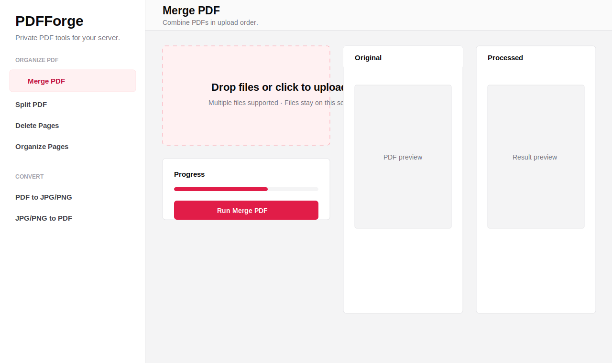

# PDFForge

PDFForge is a self-hosted Next.js 15 PDF toolbox inspired by iLovePDF. Uploads are processed on your server, temporary files are cleaned after each job, and optional history is stored in SQLite.

## Features

- Organize: merge, split by ranges/every N pages, delete pages, reorder pages, rotate pages.
- Optimize: Ghostscript compression presets and configurable page numbers.
- Edit: add text, images, shapes, redaction blocks, crop boxes, visual signature marks.
- Convert: JPG/PNG to PDF, PDF to JPG/PNG through Poppler, Office conversion hooks through LibreOffice, HTML/OCR hooks for Docker system tooling.
- Security: qpdf password protect/unlock and permission audit endpoint.
- Other: watermark, repair, OCR queue path, fillable form fill/flatten.
- UI: iLovePDF-style sidebar, drag and drop upload, progress, split preview, dark mode, success confetti, mobile responsive layout.
- Batch processing: apply compatible tools to multiple files and download a ZIP with a JSON report.
- Workflow builder: chain common operations like compress, watermark, and page numbers into one run.
- Smart compression report: response metadata and UI cards show input size, output size, saved bytes, saved percent, and compression engine.
- Redaction verification: edit/redaction jobs can scan requested `redactTerms` after processing and report whether terms remain in raw PDF streams.
- Admin dashboard: local stats endpoint and UI for total jobs, successful jobs, output volume, tool usage, and recent history.

## Screenshot



## Quick Start

```bash
npm install
npm run dev
```

Open http://localhost:3000.

## Docker

```bash
docker compose up --build
```

The Docker image installs the system tools used by advanced operations:

- `ghostscript` for compression
- `qpdf` for protect, unlock, and repair
- `poppler-utils` for PDF to image
- `libreoffice` for Office conversions
- `ocrmypdf` and `tesseract-ocr` for OCR
- `chromium` for future HTML rendering

Persistent data lives in the `pdfforge-storage` Docker volume.

## Project Structure

```text
src/app/api/process/route.ts      Multipart upload endpoint, rate limit, cleanup
src/app/api/batch/route.ts        Multi-file batch ZIP processing
src/app/api/workflow/route.ts     Sequential workflow runner
src/app/api/admin/stats/route.ts  Admin job telemetry
src/lib/server/process.ts         Server-side PDF operation dispatcher
src/lib/server/history.ts         Drizzle + SQLite optional job history
src/lib/tools.ts                  Tool catalog and default options
src/components/workspace.tsx      Main tool UI
src/components/workflow-builder.tsx Workflow step builder
src/components/admin-dashboard.tsx Usage and job history dashboard
src/components/tool-sidebar.tsx   Category sidebar
src/components/file-dropzone.tsx  Drag/drop upload
src/components/pdf-preview.tsx    Original vs processed preview
Dockerfile                        Production standalone Next.js image
docker-compose.yml                One-command self-hosting
```

## Implementation Order

1. Start with the upload and processing endpoint in `src/app/api/process/route.ts`.
2. Add pure `pdf-lib` operations first: merge, split, delete, reorder, rotate, watermark, page numbers, crop, image to PDF, forms.
3. Enable Docker system-tool operations: Ghostscript compression, qpdf security/repair, Poppler image export.
4. Wire LibreOffice, Tesseract, and Chromium-specific conversions for production fidelity.
5. Expand the drag-and-drop organizer into full thumbnail sorting with `@dnd-kit`.
6. Add persistent job history and admin retention settings.
7. Harden redaction with rasterized/structural content removal for regulated documents.

## Notes

The current code provides a complete application shell and working server routes for the primary `pdf-lib` operations. Some conversion classes depend on external command-line tools and are fully intended to run in Docker, where those packages are installed. Temporary uploads and generated outputs are removed at the end of every request.

Redaction verification currently checks requested terms against generated PDF streams and reports the result. For legal, medical, or government-grade redaction, add a rasterized redaction pipeline or a content-stream removal engine before treating the document as certified.
